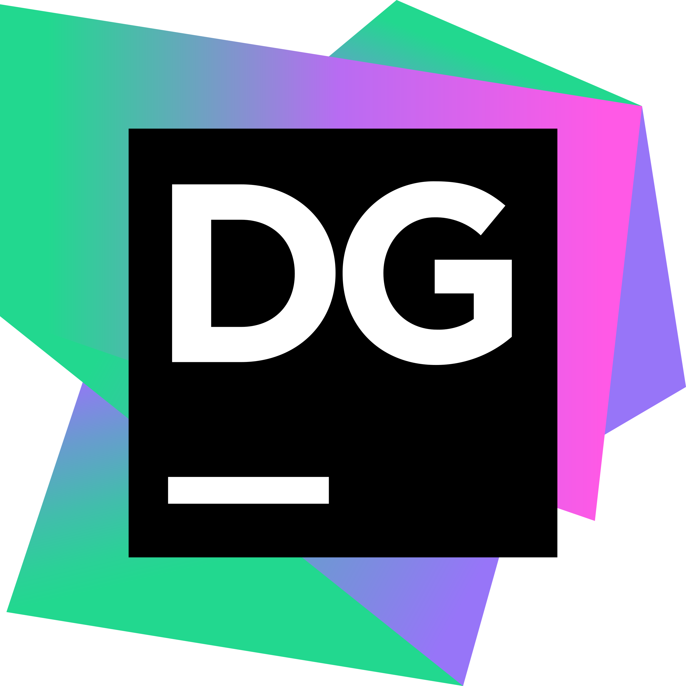

<h1 align="center">Hi, I'm Teerapong Thanbun 👋</h1>
<h3 align="center">Backend Developer | Full-Stack | Thailand 🇹🇭</h3>

---

## 🔧 Tech Stack

**Frontend**

**Backend**

**Database & ORM**

 

**Data Engineering & Big Data**

  

**Cloud & Infrastructure**

  

**Tools**

 
